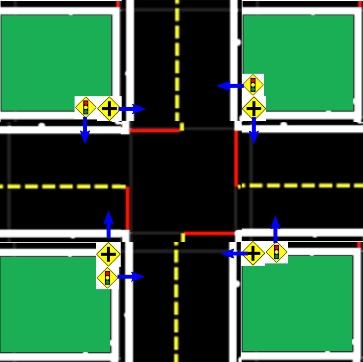

## Package intersection_navigation

The intersection navigation package in 20-indefinite-navigation contains the two nodes: intersection_navigation_node and intersection_localizer_node which run the new intersection navigation.

The following command will run the indefinite navigation demo with the new intersection navigation:

On Duckiebot make demo-intersection-navigation 

After a few seconds all the needed nodes will be launched, and you can use the joystick to drive the robot as in the current indefinite-navigation demo. Press R1 to switch to the lane following and so to the new intersection navigation when arrived to a stop line. Press L1 to switch back to the joystick control.

Video of the expected output:

<iframe width="420" height="315" src="https://www.youtube.com/watch?v=x2rPmNqhteo&feature=youtu.be" frameborder="0" allowfullscreen></iframe>

You can visualize the camera output and the current estimated pose on the laptop. In order to do it run:

On laptop roslaunch intersection_navigation intersection_visualizer_node.launch robot_name:=![robot name]

After few seconds a window will appear showing the camera output and edges projected from the estimated pose.
You can assess that localization is working properly if the projected edges will overlap the edges in the image. This is very sensitive to the camera calibration, so make sure that your calibration is fine otherwise projected edges will have large offsets from those in the image.

Things to know:

* The intersection navigation package contains the launch file which run all the needed nodes.
 
* The current implementation is integrated with the new FSM so It publishes and listens to the topics defined in it. 

* However, we currently run two extra nodes: stop_node and intersection_coordination_node. 

	The stop_node is included since we need to send stop commands when Duckiebot arrives at a red line. 	We use it in case of coordination with the others nodes developed during the course is missing.

	The intersection_coordination_node publishes the “intersection_go” topic, which tells the Duckiebot to start 	the navigation as soon as the initial localization is complete and the path is computed. This node is needed 	to simulate the tasks of the coordinators team when the navigation is run with one robot.

* Moreover, we provide a slightly modified lane controller with respect to the new lane controller node, in 10-lane-control/lane_control/scripts/lane_controller_node.py. This is needed to account for wheels’ speed thresholds.

* Refer to Navigators final report for additional information about the code architecture.

## TROUBLESHOOTING:

For a first understanding of what goes wrong, you can have a look at the terminal outputs. We print error messages that provide good information about where the problem comes from, during the navigation.

### Navigation does not start at all

Probably, the Duckiebot cannot detect any AprilTag, so make sure they are well visible from Duckiebot’s initial position.
The AprilTags should be placed as in the following intersection configuration:

    

Note: Traffic lights are not needed.

### Navigation is off the track

Camera is likely not well calibrated. You can run the visualizer node on the laptop and have a look at the printed edges. If they have large offsets from the real edges in the image, then the camera needs to be recalibrated.

### Turning radius is too large (in rare cases too small)

You can test the intersection navigation driving manually the Duckiebot with the joystick. Test the straight exit. If the Duckiebots does not go accurately straight, for example it touches the middle or boundary lines, then the kinematics calibration need to be redone.
In addition, you need to use a kinematic gain g = 0.6. Follow the kinematic calibration procedure to learn how to set your Duckiebot’s gain.
